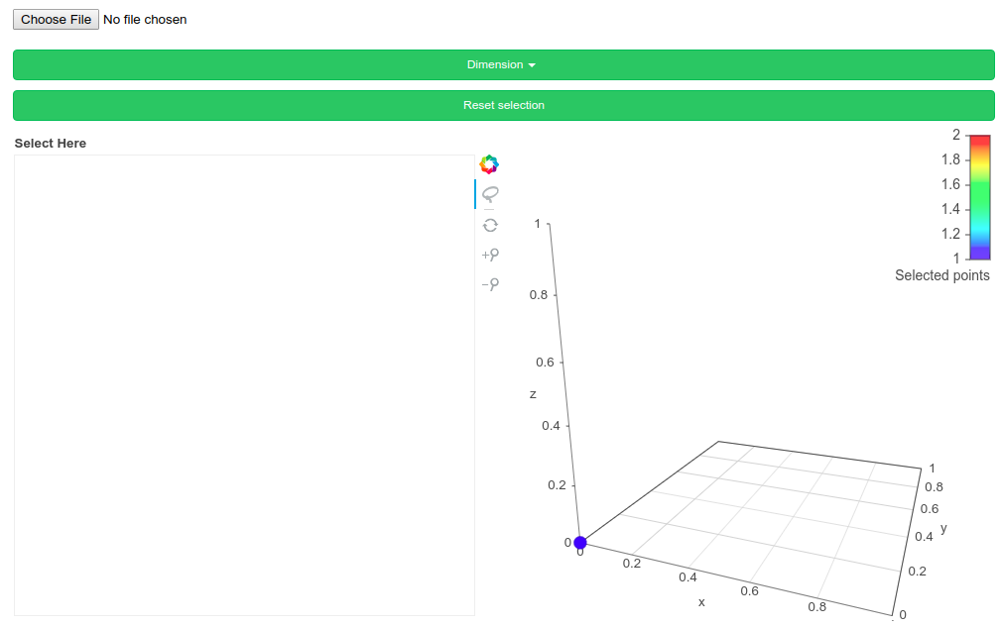

# 3dPD
----
A tool to calculate and visualize persistence diagrams and its optimal cycles in the point cloud. 

## Installation 
The following packages are needed to use the tool
- optiperlsp (can be downloaded here: https://bitbucket.org/remere/optiperslp/) 
- python3.5 or above
- bokeh 

## Usage
Download the script files and save them in a folder called 3dPD. In the directory 
above this folder, run the following command
```bash 
bokeh serve 3dPD
```
After that there will be a local server running at http://localhost:5006/3dPD. The following
page will open



This web app accepts only csv files. Each file should contain 4 columns, the first three
are the xyz  coordinates and the last coordinate is the radius for the weighted 
alpha shape filtration (thus it can be a zero column). You can then select the dimension
of the persistence diagram to be calculated, 1 or 2. After that, the corresponding
persistence diagram will be ploted on the left and the coordinates on the right. 

For each point in the persistence diagram there is an optimal cycle associated. You can 
visualize the vertices of each optimal cycle in the point cloud by selecting the points
in the persistence diagram with the lasso tool (default). See gif below for an example. 


